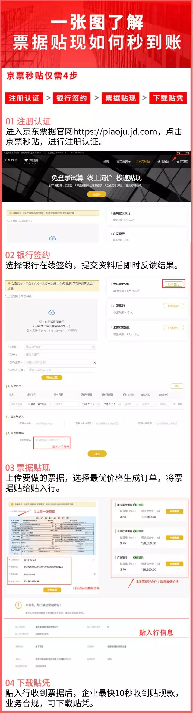
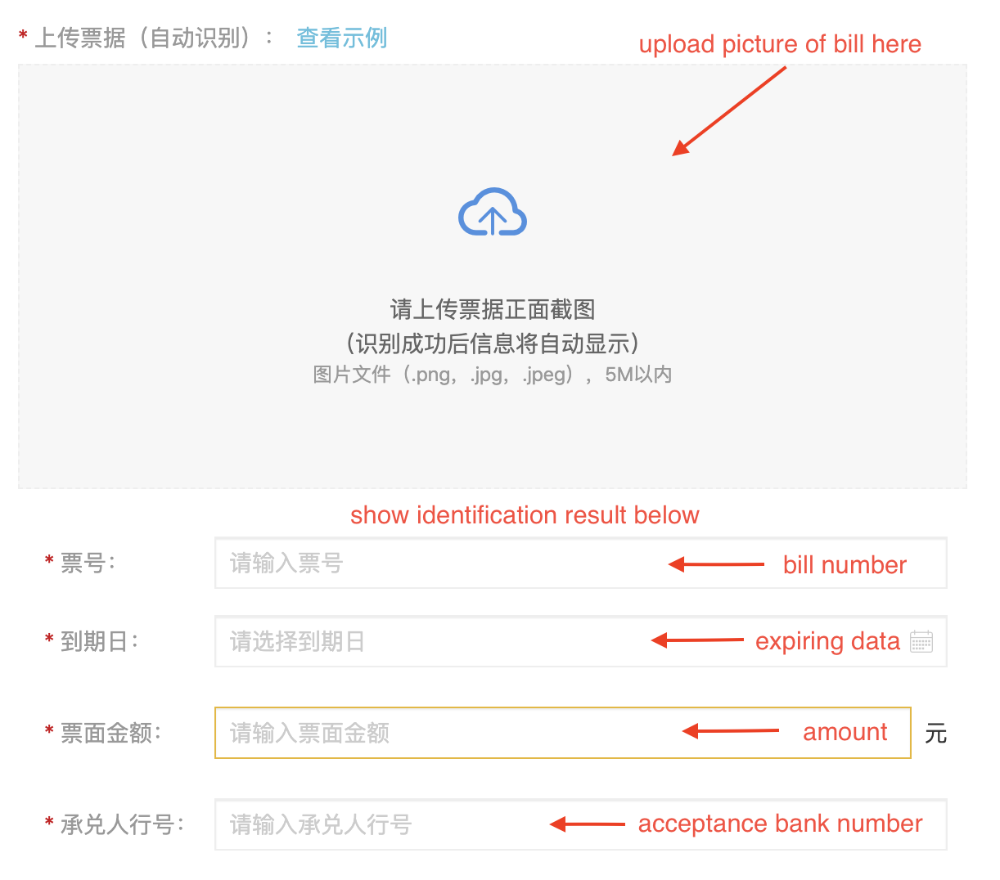
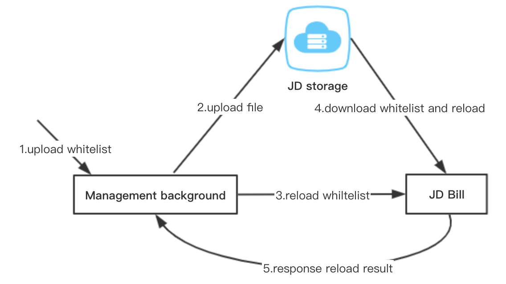

## JD Bill

Bank acceptance bills have become a low-risk financial instrument commonly used by many small, medium and micro enterprises due to their short term, high convenience and strong liquidity. Through discounted bills, companies can turn the "bills" in their hands into "cash" and accelerate corporate funds Turnover, improve the efficiency of capital use. However, the long-term asymmetry of information between small and medium-sized enterprises and financial institutions, which has led to the realization of bill financing, has always been a pain for small and medium-sized enterprises. Bank credit and discount procedures are complicated, intermediary market financing risks are high and intermediaries cannot provide compliance discount vouchers. In response to the above problems, this system aims to solve the small, micro, short, and urgent needs of small and medium-sized enterprises, open the bottleneck of the connection between assets and funds, and build a "bridge" between enterprises and financial institutions to provide compliance, efficiency, efficiency and convenient service. 

<table>
  <tr>

```
<td><b>System Homepage:</b></td>
<td><a href="https://piaoju.jd.com.io/">piaoju.jd.com</a></td>
```

  </tr>
  <tr>

```
<td><b>Chinese documentation:</b></td>
<td><a href="resource/README.cn.md">中文文档</a></td>
```

  </tr>
</table>

## Getting Started

This business mainly matches banks and enterprises. The platform provides multiple companies with their latest discount rate and other information to provide a compliant, efficient and convenient platform for corporate bill discounting. The specific use process is shown in the following figure.

<div align="center"></div>


## My Responsibilities

- Adopted Optical Character Recognition(OCR) technology to provide users with bill input function. [Implementation details](resource/OCR.md)

<div align="center"></div>

- Used distributed cache Redis, RPC and distributed file system to maintain white list of bank users. [Implementation details](resource/WHITELIST.md)

<div align="center"></div>

- Designed database structure to provide dynamic and variable quote list display for bank users, and automatically matched quotes based on order information.


- Used H-ui framework to complete the management background pages related to multiple systems.


